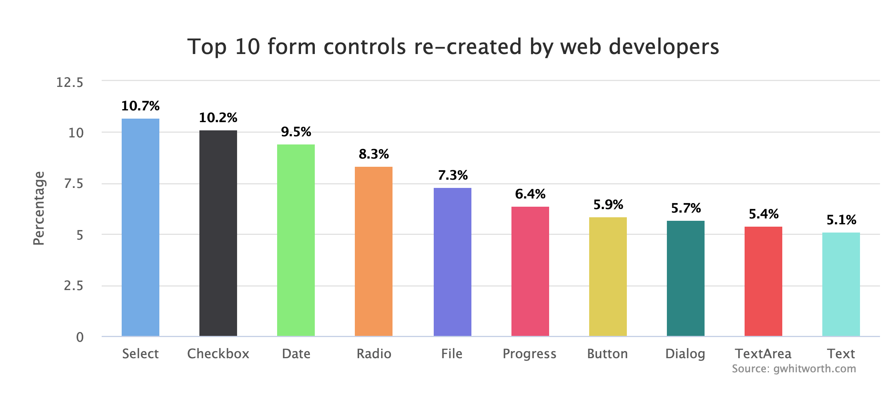

# Indicator Psuedo Element

* **STATUS:** Explainer
* **Expected Venue:** CSSWG

**Authors:**
* Brandon Ferrua, Salesforce
* Greg Whitworth, Salesforce

## Overview
Native controls and components have been a long-standing pain point for [web developers and designers](http://gwhitworth.com/blog/2019/07/form-controls-components/). Even though the behavior and general visual appearance of checkboxes and radio controls is consistent across user agents, they still rank #2 & #4 in the top re-created controls due to the lack of styling capabilities.



To enable authors to fully style a checkbox and radio control it will require definitions of new parts and a way to ensure an interopable approach to style them.

_**Note:** All examples in this document will utilize the checkbox for consistency, but the radio anatomy of the indicator itself is the same and thus is included in the normative spec text_

## the `::indicator` pseudo-element
The `indicator` pseudo-element provides a visual representation of a checkbox's or radio's current state.

The `::indicator` pseudo-element will be a child of the following [HTMLInputElements](https://html.spec.whatwg.org/multipage/input.html#the-input-element)

* [Checkbox state](https://html.spec.whatwg.org/multipage/input.html#checkbox-state-(type=checkbox))
* [Radio Button state](https://html.spec.whatwg.org/multipage/input.html#checkbox-state-(type=radio))

When paired with the `:checked` and `:indeterminate` pseudo-classes an author can adequately provide the 
end-user with a custom tailored experience for all states of each control.

## The `base` keyword value for the `appearance` property
While the `indicator` pseudo-element provides authors with a selector to a part within the control, it doesn't allow them to fully style the control due to the lack of interoperability across user agents and operating systems.

In order to allow an author to **opt-in** to being able to customize a built-in component or control we're proposing a `base` keyword value to the [appearance](https://drafts.csswg.org/css-ui-4/#appearance-switching) property. This will inform the 
user-agent to use the standardized styles and DOM structure for the control/component in order to ensure an interoperable starting point for authors.

<dl>
    <dt>
        <dfn><code>base</code></dfn>
        <dd>Similar to the <a href="https://drafts.csswg.org/css-ui-4/#ref-for-valdef-appearance-none" target="_blank">none</a> value; the element is rendered following the usual rules of CSS. Replaced elements other than <a href="https://drafts.csswg.org/css-ui-4/#widget" target="_blank">widgets</a> are not affected by this and remain replaced elements. The widget, <strong>MUST</strong> render using the standardized DOM structure and computed values for the element.
        </dd>
    </dt>
</dl>


# Putting it all together

If the `appearance` property computes to `base` for the following elements:
* [HTMLInputElement](https://html.spec.whatwg.org/multipage/input.html#the-input-element) in a [Checkbox state](https://html.spec.whatwg.org/multipage/input.html#checkbox-state-(type=checkbox))
* [HTMLInputElement](https://html.spec.whatwg.org/multipage/input.html#the-input-element) in a [Radio Button state](https://html.spec.whatwg.org/multipage/input.html#checkbox-state-(type=radio))

The user-agent **MUST** make the immediate child of the `::indicator` pseudo-element the following SVG for the [HTMLInputElement](https://html.spec.whatwg.org/multipage/input.html#the-input-element) in a [Checkbox state](https://html.spec.whatwg.org/multipage/input.html#checkbox-state-(type=checkbox)):

```
<svg id="indicator" viewBox="0 0 187.44 231.39" width="100%" height="100%">
    <path d="m7.54 136.22 58.3 76.55s39-110.33 114.15-207"/>
    <rect width="50%" height="5%" y="50%" x="30%" />
</svg>
```

And the following styles **MUST** be the computed value in the user-agent's stylesheet:

```

/* NOTE: THIS IS AN EARLY DRAFT OF THE STYLES AND WILL EVOLVE
         BASED ON FEEDBACK FROM USER-AGENTS AND COMPONENT AUTHORS */

input[type=checkbox] {
    display: flex;
    width: 13px; 
    height: 13px;
    border: 1px solid #888;
    border-radius: 2px;
    box-sizing: border-box;
    fill: none;
    stroke: #231f20;
    stroke-miterlimit: 10;
    align-items: center;
    justify-content: center;
}

input[type=checkbox]::indicator {
    display: none;
    fill: none;
    stroke: #231f20;
    stroke-miterlimit: 10;
    stroke-width:17px;
    align-items: center;
    padding: 0 25% 0 25%;
    justify-content: center;
    margin: -2px 0 0 -2px;
}

input[type=checkbox]:checked::indicator,
input[type=checkbox]:indeterminate::indicator {
    display: flex;
}

input[type=checkbox]:indeterminate::indicator rect {
    display: block;
}

input[type=checkbox]:indeterminate::indicator path {
    display: none;
}

input[type=checkbox]:checked::indicator path {
    display: block;
}

input[type=checkbox]::indicator > * {
    display: none;
}

/* MORE STYLES TO BE DEFINED AT A LATER DATE */

```

By providing an interoperable DOM structure and computed styles the pseudo-element is fully styleable. 

Below are some examples of this in practice:


**Note:** *These examples can be seen in this Codepen Project [here](https://codepen.io/gregwhitworth/project/full/DkGOoY).

## Open Questions

* The `d` attribute is a presentational but in order to utilize it there would need to be another pseudo element on the path(s). There would also need to be a solution to viewbox adjustment from CSS ([Issue 7 in FXTF](https://github.com/w3c/fxtf-drafts/issues/7))
* While this pseudo-element gets the web platform closer to what authors desire there are still some advanced use cases this does not enable. Should we introduce a new `<checkbox>` element that enables these complex scenarios?

## Other Solutions Considered

### Unicode
One consideration, which is often used by authors in the `::before` or `::after` pseudo-element is to utilize the 2713 unicode code point for checkboxes. Using this unicode code point is an elegant proposal in that all browsers on all operating systems currently use the same graphic provided by the OS; thus achieving interoperability. Below is a reference comparison across iOS, Android, Windows and MacOS and various browsers.


While this is a solid start and would make implementation much simpler this unfortunately does not enable many of the 
designs that are found across the web today as you can only propogate certain CSS properties, such as `color `in order to modify the color but you can't adjust strokes, joints, fills to the extent that can be done with SVG. Due to these limitations this direcion was abandoned.

### Background images
When initially exploring the password-reveal pseudo-element we defined it to be a background image. This would allow the author to replace 
the graphic using an image or the Houdini `paint()` method. This has negative implications in that it came with the following constraints:

* **Unknown parent styles & anatomy:** While the pseudo element and application of the graphic would be standard. The author would have no insight into how its ancestor tree would be structured nor styled. One concrete example of this was trying to replicate a scenario where the pseudo-element would reside outside of the input but there was an ancestor that couldn't be reached between the pseudo-element & the input. This resulted in the psuedo-element being clipped.
* **Needing graphic design capabilities:** Using a background-image unlocked some scenarios but it still required an author to produce and asset to replace it. Looking at the accent-color scenarios again the authors had no issues with the graphic but simply the colors. Forcing them to create a graphic to meet their needs just perpetuates the problem.

## Resources

* [Presentation](https://docs.google.com/presentation/d/1UetqOgKR6zcKaqahftirCleh7HTjka1qvem7qP8RTV8/edit?usp=sharing) of the indicator pseudo element to the CSSWG

## Acknowledgements

* Melanie Richards, Microsoft
* Tab Atkins, Google
