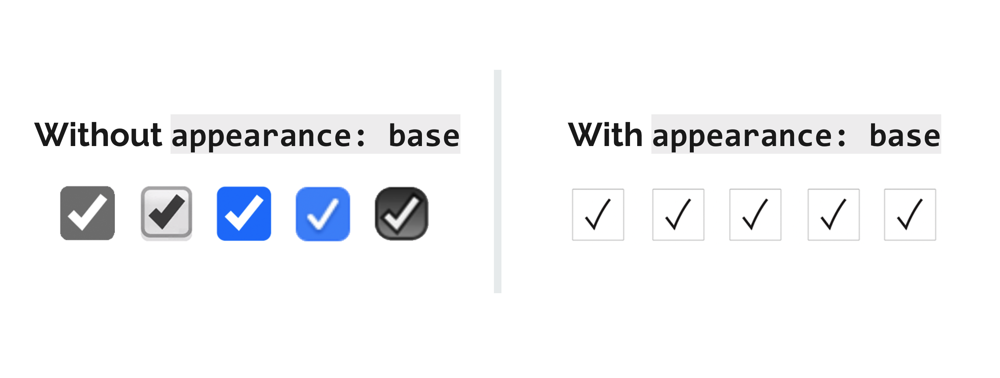
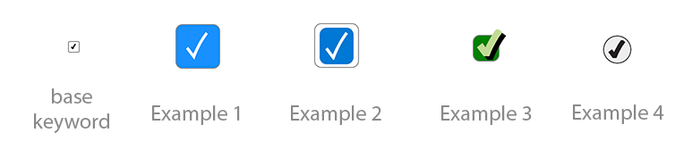
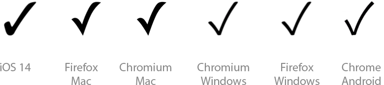

# Indicator Pseudo Element

* **STATUS:** Explainer
* **Expected Venue:** CSSWG

**Authors:**
* Brandon Ferrua, Salesforce
* Greg Whitworth, Salesforce

## Overview
Native controls and components have been a long-standing pain point for [web developers and designers](http://gwhitworth.com/blog/2019/07/form-controls-components/). Even though the behavior and general visual appearance of checkboxes and radio controls is consistent across user agents, they still rank #2 & #4 in the top re-created controls due to the lack of styling capabilities.


To enable authors to fully style a checkbox and radio control it will require definitions of new parts and a way to ensure an interopable approach to style them.

_**Note:** All examples in this document will utilize the checkbox for consistency, but the radio anatomy of the indicator itself is the same and thus is included in the normative spec text_

## the `::indicator` pseudo-element
The `indicator` pseudo-element provides a visual representation of a checkbox's or radio's current state.

The `::indicator` pseudo-element will be a child of the following [HTMLInputElements](https://html.spec.whatwg.org/multipage/input.html#the-input-element)

* [Checkbox state](https://html.spec.whatwg.org/multipage/input.html#checkbox-state-(type=checkbox))
* [Radio Button state](https://html.spec.whatwg.org/multipage/input.html#checkbox-state-(type=radio))

When paired with the `:checked` and `:indeterminate` pseudo-classes an author can adequately provide the 
end-user with a custom tailored experience for all states of each control.

## The `base` keyword value for the `appearance` property
While the `indicator` pseudo-element provides authors with a selector to a part within the control, it doesn't allow them to fully style the control due to the lack of interoperability across user agents and operating systems.

In order to allow an author to **opt-in** to being able to customize a built-in component or control we're proposing a `base` keyword value to the [appearance](https://drafts.csswg.org/css-ui-4/#appearance-switching) property. This will inform the 
user-agent to use the standardized styles and DOM structure for the control/component in order to ensure an interoperable starting point for authors.

<dl>
    <dt>
        <dfn><code>base</code></dfn>
        <dd>Similar to the <a href="https://drafts.csswg.org/css-ui-4/#ref-for-valdef-appearance-none" target="_blank">none</a> value; the element is rendered following the usual rules of CSS. Replaced elements other than <a href="https://drafts.csswg.org/css-ui-4/#widget" target="_blank">widgets</a> are not affected by this and remain replaced elements. The widget, <strong>MUST</strong> render using the standardized DOM structure and computed values for the element.
        </dd>
    </dt>
</dl>



# Putting it all together

If the `appearance` property computes to `base` for the following elements:
* [HTMLInputElement](https://html.spec.whatwg.org/multipage/input.html#the-input-element) in a [Checkbox state](https://html.spec.whatwg.org/multipage/input.html#checkbox-state-(type=checkbox))
* [HTMLInputElement](https://html.spec.whatwg.org/multipage/input.html#the-input-element) in a [Radio Button state](https://html.spec.whatwg.org/multipage/input.html#checkbox-state-(type=radio))

The user-agent **MUST** make the immediate child of the `::indicator` pseudo-element the following SVG for the [HTMLInputElement](https://html.spec.whatwg.org/multipage/input.html#the-input-element) in a [Checkbox state](https://html.spec.whatwg.org/multipage/input.html#checkbox-state-(type=checkbox)):

```
<svg id="indicator" viewBox="0 0 187.44 231.39" width="100%" height="100%">
    <path d="m7.54 136.22 58.3 76.55s39-110.33 114.15-207"/>
    <rect width="50%" height="5%" y="50%" x="30%" />
</svg>
```

And the following styles **MUST** be the computed value in the user-agent's stylesheet:

```

/* NOTE: THIS IS AN EARLY DRAFT OF THE STYLES AND WILL EVOLVE
         BASED ON FEEDBACK FROM USER-AGENTS AND COMPONENT AUTHORS */

input[type=checkbox] {
    display: flex;
    width: 13px; 
    height: 13px;
    border: 1px solid #888;
    border-radius: 2px;
    box-sizing: border-box;
    fill: none;
    stroke: #231f20;
    stroke-miterlimit: 10;
    align-items: center;
    justify-content: center;
}

input[type=checkbox]::indicator {
    display: none;
    fill: none;
    stroke: #231f20;
    stroke-miterlimit: 10;
    stroke-width:17px;
    align-items: center;
    padding: 0 25% 0 25%;
    justify-content: center;
    margin: -2px 0 0 -2px;
}

input[type=checkbox]:checked::indicator,
input[type=checkbox]:indeterminate::indicator {
    display: flex;
}

input[type=checkbox]:indeterminate::indicator rect {
    display: block;
}

input[type=checkbox]:indeterminate::indicator path {
    display: none;
}

input[type=checkbox]:checked::indicator path {
    display: block;
}

input[type=checkbox]::indicator > * {
    display: none;
}

/* MORE STYLES TO BE DEFINED AT A LATER DATE */

```

By providing an interoperable DOM structure and computed styles the pseudo-element is fully styleable. 

Below are some examples of this in practice:



Here is what the CSS the author would need to write in order to achieve example 3:

```
[type=checkbox] { 
    appearance: base; 
    width: 30px; 
    height: 30px; 
}

[type=checkbox]::indicator {
    position: absolute;
    stroke: #C2DB95;
    top: -10px;
    right: -10px;
    stroke-width: 50px;
    filter: drop-shadow( 4px 4px 0 rgba(0, 0, 0, 1));
 }
```

**Note:** *These examples can be seen in this Codepen Project [here](https://codepen.io/gregwhitworth/project/full/DkGOoY).

## Open Questions

* The `d` attribute is a presentational but in order to utilize it there would need to be another pseudo element on the path(s). There would also need to be a solution to viewbox adjustment from CSS ([Issue 7 in FXTF](https://github.com/w3c/fxtf-drafts/issues/7))
* While this pseudo-element gets the web platform closer to what authors desire there are still some advanced use cases this does not enable. Should we introduce a new `<checkbox>` element that enables these complex scenarios?

## Other Solutions Considered / FAQ

### Why not use U+2713 as the content of the ::indicator?



While that glyph is similar in typical environments, it's font dependent, and not identical. In the case of `appearance: auto`, it's perfectly fine to have controls that vary per platform, but here were are aiming for an interoperable base as a starting point for customization. While the differences between various fonts are small on this character are small, they exist, and that's inviting trouble. An author might for example find the glyph they get to be too thin and add something to make it thicker, only to have that be inappropriate on a different OS where it was thick to start with.

Theoretically, CSS has lots of properties that can let you customize text to a fairly large degree, including `text-stroke` and `text-fill`, but support for them is still more shaky than the equivalent functionality in SVG.

As an extension point, we could introduce an additional pseudo that maps to the path element of the SVG, and let you adjust it. We don't yet have all the pieces in place to make that work, but it's a possible next step that isn't available if we start from a glyph, whose structure is definitely opaque. Strictly speaking, we might not need that if/when we add the possibility to replace the whole content of the `::indicator` with an alternate piece of structured markup, but (1) we haven't secured the ability to do that yet, and (2) even if we do, it could be nice to be able to tweak something in place, rather than have to replace the whole thing. Keeping the design extensible and future proof is good, even we don't end up acting on all the possible extension points. SVG offers more than text in that respect.

### Why not just use ::before or ::after?

Checkboxes are simple enough that you can create a believable one with nothing but an empty div and styling the `::before` or `::after` with generated content. However:
    - Most other controls are not that simple and will need a somewhat complex anatomy that cannot be represented by ::before and ::after alone. Since this is part of a system, being consistent has value.
    - Changing the content of `::before` and `::after` is done through stylesheets. If/when we add a mechanism to replace the content of the indicator with something arbitrarily complicated, that probably won't be via the stylesheet, as that cannot create complex structures within an element. `::before` and `::after` can only contain text or images, not inlining SVGs with their full structure, so that would be limiting.
    - Inserting complex SVGs via CSS's content property is doable, but cumbersome
    
### What's wrong with SVG as images (as could be used in ::before or ::after)?

- Even if you can replace an SVG image with another SVG image that's the same thing with one attribute/property changed, that's nowhere near as convenient as being able to change a property from CSS, and you cannot animate between the two states (which you might want to do on `:hover`, or as a transition in or out of `:checked` for example)
- SVG-as-images cannot do all the things that inline SVGs can do. It's not clear that many of these things are necessary for a checkbox/radio `::indicator`, but choosing the more expressive / extensible path seems more future proof.

### How can we know we picked the right design for the SVG?

We don't expect it to be sufficient to satisfy every design, merely to be sufficiently plain and simple to broadly acceptable and easily tweakable. We do expect that more advanced usage (and possibly future trends) will call for a means to replace it, and we do intend to provide that eventually. In the meanwhile, something like what we proposed here should already cover a lot of ground. (btw, we're not locked onto the particular design showcased here, and are open to alternative suggestions, but we feel it should be something with roughly that level of complexity.)

## Resources

* [Presentation](https://docs.google.com/presentation/d/1UetqOgKR6zcKaqahftirCleh7HTjka1qvem7qP8RTV8/edit?usp=sharing) of the indicator pseudo element to the CSSWG

## Acknowledgements

* Melanie Richards, Microsoft
* Tab Atkins, Google
* Florian Rivoal
